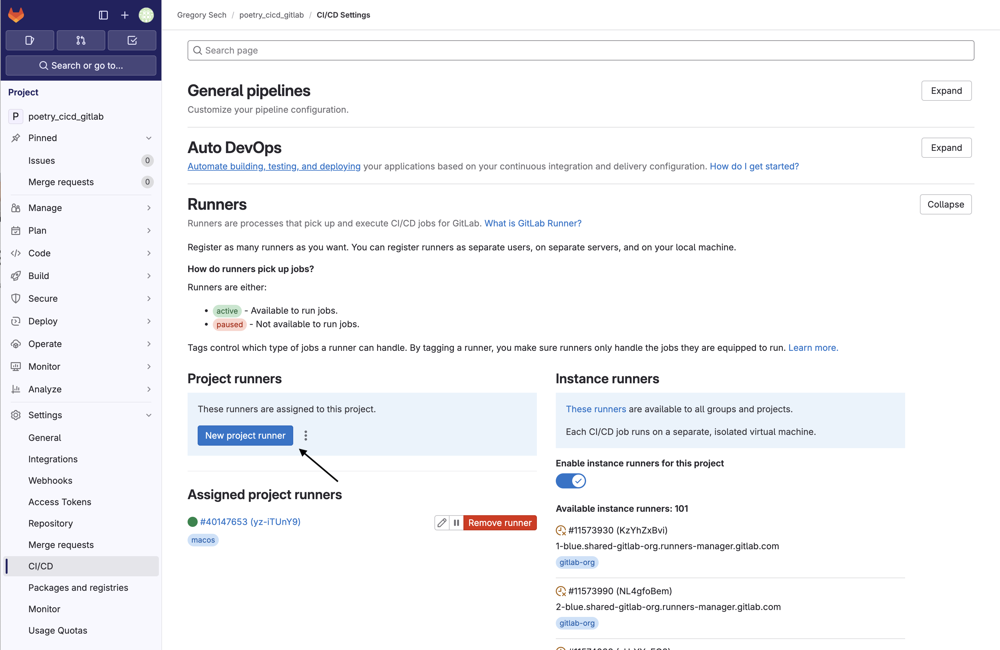

+++
title = "Note su GitLab Pipelines locali in un progetto Poetry"
date = 2024-07-22
draft = false
[taxonomies]
tags = ["GitLab", "Python", "Poetry", "CICD", "Docker", "Italiano", "Italian"]
+++

Automatizzare test quando nuovo codice viene aggiunto ad un progetto è un semplice modo per assicurarsi di non modificare il comportamento di software già sviluppato.
Sicuramente gli sviluppatori dovranno dedicare tempo e fatica a tradurre i requisiti del software in controlli programmatici, ma la loro automazione riduce il tempo necessario per assicurare la qualità del codice.

La Max Planck Computing and Data Facility (MPCDF) [ha pubblicato un bel tutorial](https://docs.mpcdf.mpg.de/doc/data/gitlab/devop-tutorial.html) sulla propria wiki sull'uso di [GitLab's Pipelines](https://docs.gitlab.com/ee/ci/pipelines/) per automatizzare test di progetti Python che usano [Poetry](https://python-poetry.org/). 

A volte, eseguire task automatizzati sulla propria workstation può essere ergonomico o necessario. Se la tua organizzazione non mette a disposizione dei GitLab Runners consoni per il tipo di automazioni che si intendono sviluppare queste note possono aiutarti.
Ti mostrerò come creare un semplice progetto Python usando `poetry` e come mettere in piedi un'istanza di GitLab Runner per automatizzare i test ed i controlli di formattazione del codice.
## Setup del progetto
Crea il progetto (`poetry-cicd-gitlab`) usando il comando: `poetry new poetry-cicd-gitlab`.

Successivamente io ho modificato la configurazione di progetto in modo che l'ambiente virtuale di Python venga creato nella cartella di progetto usando: `poetry config virtualenvs.in-project true --local`. Questo create un file `poetry.toml` contenendo la configurazione di `poetry` per questo progetto.

Quindi aggiungo un paio di dipendenze "di sviluppo" ("dev dependencies") al progetto:  [black](https://github.com/psf/black) e [pytest](https://docs.pytest.org/). 
```bash 
poetry add --group dev black pytest
```

`black` è una utility per formattare il codice. A me piace il default di `black` quindi è diventata la mia scelta per progetti Python.
`pytest` è un framework per testare programmaticamente applicazioni e librerie sviluppate in Python.

Crea una funzione da testare dentro al modulo principale di progetto `poetry_cicd_gitlab/__init__.py` e testala in una funzione chiamata col [prefisso `test`](https://docs.pytest.org/en/8.2.x/explanation/goodpractices.html#test-discovery) dentro a `tests/test_add.py`.
In questo modo:
```python 
# poetry_cicd_gitlab/__init__.py
def add(a, b):
    return a + b
```

```python 
# tests/test_add.py
from poetry_cicd_gitlab import add

def test_add():
    assert add(1, 1) == 2
```

Lanciare il comando `poetry run pytest` dovrebbe identificare un singolo test che dovrebbe passare. 

Ora abbiamo un progetto scarno che possiamo testare e uno strumento per formattare automaticamente il codice che aggiungiamo al nostro progetto.
Quindi facciamo una repository su GitLab su cui versionare il nostro codice.
# Setup di GitLab Runner
A questo punto vai sulla istanza di GitLab che intendi usare, crea la repository tramite l'interfaccia e carica il progetto.
Generalmente è una buona idea lasciare fuori dal sistema di controllo versione le cartelle  `__pycache__`, `.venv` e `.pytest_cache` usando un file `.gitignore`.

Dopo aver caricato il codice dobbiamo preparare il necessario per la nostra [Pipeline](https://docs.gitlab.com/ee/ci/pipelines/). Prima di procedere suggerisco di comunque dare una buona letta alla risorsa ufficiale ["Tutorial: Create and run your first GitLab CI/CD pipeline"](https://docs.gitlab.com/ee/ci/quick_start/) 

In quest'altra [pagina della documentazione](https://docs.gitlab.com/runner/install/docker.html) troverai descritto come installare localmente `gitlab-runner` usando `docker`. 
Questo avviene in due step. Il primo è registrare il runner mentre il secondo è eseguirlo.

Per registrare il runner usa:
```bash
docker run --rm -i -t \
-v ./runner-config:/etc/gitlab-runner \
-v /var/run/docker.sock:/var/run/docker.sock \
gitlab/gitlab-runner:latest \
register  --url <gitlab instance url here>  --token <register token here>
```

Questo token viene fornito dalla procedura di registrazione nell'istanza di GitLab. Nello specifico nella tendina delle impostazioni della repository, sezione CI/CD, titoletto "Runners". 

Ricorda di mettere la spunta a "Run untagged jobs" in modo che il runner possa eseguire qualsiasi task da questa repository.



Il comando `register` menzionato precedentemente chiederà di inserire qualche informazione. Alla richiesta di un'immagine di default io ho specificato `python:3.11` perché il progetto usa Python.
L'esecuzione del comando genererà un file `runner-config/config.toml` contenente la configurazione per il runner e può essere editata per meglio rispondere alle esigenze di progetto.

Per lasciar eseguire al runner i task usiamo
```bash 
docker run -d --name gitlab-runner --restart always \
  -v ./runner-config:/etc/gitlab-runner \
  -v /var/run/docker.sock:/var/run/docker.sock \
  gitlab/gitlab-runner:latest run
```

Ora siamo pronti ad eseguire una Pipeline, dobbiamo solo scriverla!
# Scrivere la Pipeline

La pipeline in questo esempio dovrà:
1. Rendere disponibile `poetry`. Nel nostro esempio questo può anche andare bene ma idealmente vogliamo fornire ai nostri job un container. Il container ci eviterebbe un download inutile di dipendenze di progetto quali poetry.
2. Lanciare tutti i test e generare un report.
3. Controllare che il codice abbia una formattazione consona per `black` o se è meglio lanciare l'utility. 

Per installare poetry inserisci i seguenti comandi nella sezione `before_script`. In questo modo verranno eseguiti prima di ogni job.

```yaml  
before_script:
  - curl -sSL https://install.python-poetry.org | POETRY_HOME=/etc/poetry python3 -
  - export PATH=/etc/poetry/bin:PATH
  - poetry install
```

La nostra pipeline non deve per forza essere lanciata in successione quindi possiamo avere un solo elemento dentro alla sezione `stages` di `.gitlab-ci.yml`': `checks`.

Il job per verificare la formattazione è semplice: 
```yaml
job_format:
  stage: checks
  script:
    - echo "Checking code formatting"
    - poetry run black . --check
```
Ovvero lancia `black . --check` usando la versione installata da `poetry`.

Invece l'automazione di `pytest` è lievemente più complessa. É necessario specificare che verrà generato un artefatto: il test report nel formato JUnit.
```yaml
job_test:
  stage: checks
  script:
    - echo "Running tests"
    - poetry run pytest --junit-xml=report.xml
  artifacts:
    when: always
    paths:
      - report.xml
    reports:
      junit: report.xml
```
Con questo la nostra pipeline è pronta, possiamo fare commit e push del file  `.gitlab-ci.yml`nella nostra repository. GitLab si occuperà di invocare l'istanza di `gitlab-runner` registrata in precedenza ed eseguire gli script che abbiamo definito.
# Conclusione
In queste note ho simulato cosa fare per usare test automatizzati in istanze GitLab prive di istanze di GitLab Runner.
Ho creato un progettino ai minimi termini usando `poetry` e preparato un'istanza locale di GitLab Runner per eseguire una pipeline di automazione. Il progetto è consultabile in [questa repository pubblica](https://gitlab.com/GregorySech/poetry_cicd_gitlab)!
La pipeline automatizza i controlli sul formato del codice usando `black` e sui test ogni volta che viene fatto commit di codice nella repository. 
La pipeline proposta necessita di modifiche ingenti per soddisfare al meglio le necessità di progetti realistici senza sprecare risorse ma è un punto di partenza.
