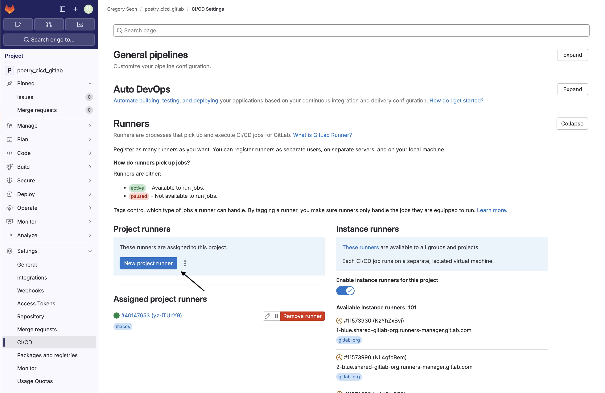

+++
title = "Notes on running GitLab Pipelines locally in a Poetry project"
date = 2024-07-22
draft = false
[taxonomies]
tags = ["GitLab", "Python", "Poetry", "CICD", "Docker"]
+++

Automating tests on code push is a simple way to ensure that writing new code is not breaking the behaviour of the existing software.
For sure developers will need to put in the time and effort to translate the software requirements in programmatic checks however, their automation reduces the overall time required to assure quality.

The Max Planck Computing and Data Facility (MPCDF) [published a nice tutorial](https://docs.mpcdf.mpg.de/doc/data/gitlab/devop-tutorial.html) on their wiki on using [GitLab's Pipelines](https://docs.gitlab.com/ee/ci/pipelines/) to automate tests for Python projects using [Poetry](https://python-poetry.org/). 

Running automated jobs on your workstation can be a lifesaver. If your organisation does not provide GitLab Runners suitable for the automation you want to implement these notes can help you.
I will show how to create a simple Python project using `poetry` and set up a local instance of GitLab Runner to automate testing and code formatting.
## Project Setup
Create the project using the command: `poetry new poetry-cicd-gitlab`.

I've changed the project's configuration so that Python's virtual environment would be created in the local directory using: `poetry config virtualenvs.in-project true --local`. This creates a `poetry.toml` file containing the local configuration for poetry.

I'm adding a few "dev" dependencies to the project: [black](https://github.com/psf/black) and [pytest](https://docs.pytest.org/). 
```bash 
poetry add --group dev black pytest
```

`black` is a code formatter, I like its defaults so it has become my go-to choice for Python projects.
`pytest` is a framework to test Python applications and libraries.

Create a function to test inside the project's module `poetry_cicd_gitlab/__init__.py` and test it with a function starting with the [prefix `test`](https://docs.pytest.org/en/8.2.x/explanation/goodpractices.html#test-discovery) inside `tests/test_add.py`.
Like so:
```python 
# poetry_cicd_gitlab/__init__.py
def add(a, b):
    return a + b
```

```python 
# tests/test_add.py
from poetry_cicd_gitlab import add

def test_add():
    assert add(1, 1) == 2
```

Running `poetry run pytest` should collect 1 test and it should pass.
Now we have a mostly empty project with a test and a way to format code automatically when we add code to our project. So let's make a repository on GitLab to store it.
# Repository Setup
At this point go to your designed GitLab instance, create a repository for the project, and push the appropriate code.
Generally, it's a good idea to leave out of version control the `__pycache__`, `.venv` and `.pytest_cache` folders using a `.gitignore` file.

After pushing the code it's time to prepare our [Pipeline](https://docs.gitlab.com/ee/ci/pipelines/). I strongly recommend following the official ["Tutorial: Create and run your first GitLab CI/CD pipeline"](https://docs.gitlab.com/ee/ci/quick_start/) 

This [documentation](https://docs.gitlab.com/runner/install/docker.html) page describes how to install `gitlab-runner` using `docker`. 
This happens in two steps: runner registration and execution.

To register the runner use:
```bash
docker run --rm -i -t \
-v ./runner-config:/etc/gitlab-runner \
-v /var/run/docker.sock:/var/run/docker.sock \
gitlab/gitlab-runner:latest \
register  --url <gitlab instance url here>  --token <register token here>
```

The token is provided by the registration procedure found on the repository's CI/CD settings page, in the "Runners" section. 

 Remember to check "Run untagged jobs" to have this runner run all jobs.



The `register` command will prompt you with a few questions. When asked for a default image I specified `python:3.11` because my project runs Python.
Executing the command above will generate a `runner-config/config.toml` file. This file contains the configuration for the runner that can be edited to fit your needs.

Now the runner can be executed using
```bash 
docker run -d --name gitlab-runner --restart always \
  -v ./runner-config:/etc/gitlab-runner \
  -v /var/run/docker.sock:/var/run/docker.sock \
  gitlab/gitlab-runner:latest run
```

We're ready to get a Pipeline running, we need to write it tho!
# Writing the Pipeline

The pipeline for this example needs to:
1. Set up poetry. This is fine only in a toy example. Ideally, a container image for the project should be provided to avoid re-downloading all dependencies for every job in the pipeline.
2. Run all tests and create a report.
3. Check if the code formatting is good or if black should be run.

To set up poetry in the image use the `before_script` section to run a set of commands before each job execution.

```yaml  
before_script:
  - curl -sSL https://install.python-poetry.org | POETRY_HOME=/etc/poetry python3 -
  - export PATH=/etc/poetry/bin:PATH
  - poetry install
```

The pipeline has only one stage so the `.gitlab-ci.yml`'s `stages` property will contain only one element: `checks`.

The job to check the formatting is quite simple:
```yaml
job_format:
  stage: checks
  script:
    - echo "Checking code formatting"
    - poetry run black . --check
```
It simply runs `black . --check` using the version installed by `poetry`.

The job for `pytest` is a bit more complex. It has to specify that it creates an artefact: the test report in JUnit format.
```yaml
job_test:
  stage: checks
  script:
    - echo "Running tests"
    - poetry run pytest --junit-xml=report.xml
  artifacts:
    when: always
    paths:
      - report.xml
    reports:
      junit: report.xml
```
With this our pipeline is done, you can commit and push the `.gitlab-ci.yml` file on the repository. GitLab will invoke your instance of `gitlab-runner`, and execute the scripts you provided.
# Conclusion
In these notes, I wanted to simulate what you might need to do if you have to use a GitLab instance that does not have runners for automated testing.
I've created a bare-bone project using `poetry` and set up a local instance of GitLab Runner to run an automation pipeline. The project can be found in [this public repository](https://gitlab.com/GregorySech/poetry_cicd_gitlab)!
Thanks to this automation the repository will automatically check that the code is formatted using `black` and that `pytest` tests are run at every commit.
The proposed pipeline should be heavily modified to fit your needs and avoid wasting resources but it's a starting point.
