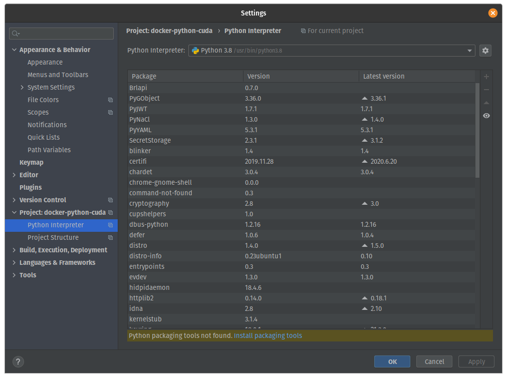
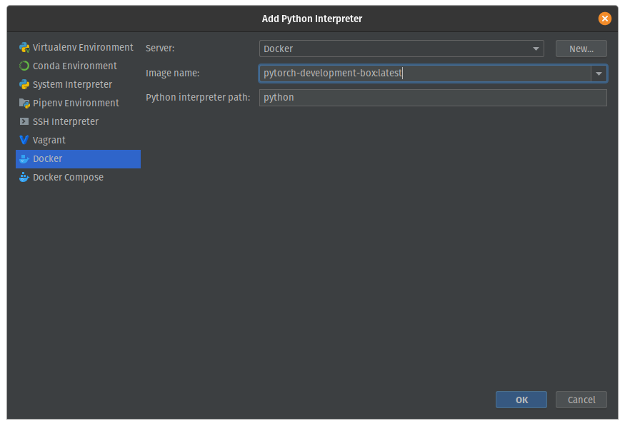
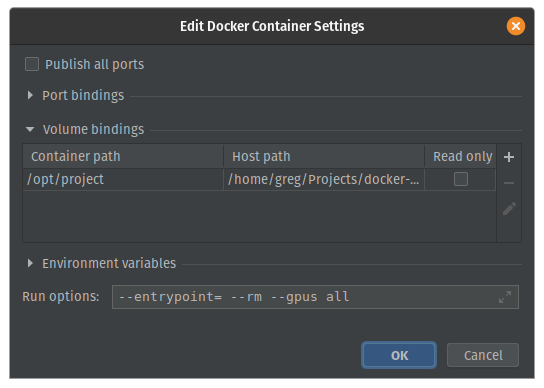

+++
title = "Usare Docker per sviluppare in Python con CUDA in PyCharm e/o Visual Studio Code"
date = 2020-08-11
[taxonomies]
tags = ["Docker", "CUDA", "Python", "VSCode", "PyCharm", "Tutorial", "Italiano", "Italian"]
+++
> Preparare la tua IDE di fiducia per sviluppare con Python usando una tua immagine Docker con supporto a CUDA.

## Introduzione
Mettere in piedi un ambiente di sviluppo non è facile se si è inesperti, specialmente se molte tecnologie che si stanno ancora imparando sono coinvolte.   
Questo tutorial ti mostrerà come usare PyCharm o Visual Studio Code per usare una immagine Docker per sviluppare in Python con supporto a CUDA.

### Disclaimers
- Durante la stesura del tutorial **non sono stato in grado di usare CUDA con Docker in Windows 10 Home** (neanche con l'Insider build), quindi è stato pensato con **Linux** in mente anche se non c'è praticamente nulla di specifico ad una singola piattaforma.
- Usare Docker come un interprete Python remoto in PyCharm è possibile solo con l'edizione Professional.
- Suppongo che [Docker](https://www.docker.com/get-started) sia già installato correttamente sulla tua macchina.
- Assumo anche che [CUDA](https://developer.nvidia.com/cuda-toolkit) sia già installato sulla tua macchina. Se stai ancora configurando la tua macchina con Linux e non hai voglia di spendere troppo tempo a fare ricerche consiglio fortemente la distribuzione [Pop!_OS](https://pop.system76.com/). In [questo articolo](https://support.system76.com/articles/cuda/) viene spiegato come installare CUDA e cuDNN molto facilmente sulla loro piattaforma. Inoltre spiegano anche come installare i loro pacchetti su Ubuntu.

## Struttura del progetto
Userò solamente 3 file in questo progettino:
- Un `Dockerfile` per generare il container Docker.
- Un file `requirements.txt` che conterrà le dipendenze Python del progetto.
- Uno script `run.py` che contiene il codice da eseguire.

Ovviamente il tuo progetto sarà più complesso, inoltre è probabile che userai un metodo differente per gestire le tue dipendenze o che vorrai usare `docker-compose` ma queste sono complessità che sviano dall'obiettivo del tutorial.
### Dockerfile

Per un articolo più specializzato su Docker ed i Dockerfile consiglio [Docker Beginner's Guide](https://medium.com/codingthesmartway-com-blog/docker-beginners-guide-part-1-images-containers-6f3507fffc98).  
Segue il `Dockerfile` del progetto ed una spiegazione delle sue parti:

```dockerfile 
FROM nvidia/cuda:10.2-devel

# Miniconda install copy-pasted from Miniconda's own Dockerfile reachable 
# at: https://github.com/ContinuumIO/docker-images/blob/master/miniconda3/debian/Dockerfile

ENV PATH /opt/conda/bin:$PATH

RUN apt-get update --fix-missing && \
    apt-get install -y wget bzip2 ca-certificates libglib2.0-0 libxext6 libsm6 libxrender1 git mercurial subversion && \
    apt-get clean

RUN wget --quiet https://repo.anaconda.com/miniconda/Miniconda3-latest-Linux-x86_64.sh -O ~/miniconda.sh && \
    /bin/bash ~/miniconda.sh -b -p /opt/conda && \
    rm ~/miniconda.sh && \
    /opt/conda/bin/conda clean -tipsy && \
    ln -s /opt/conda/etc/profile.d/conda.sh /etc/profile.d/conda.sh && \
    echo ". /opt/conda/etc/profile.d/conda.sh" >> ~/.bashrc && \
    echo "conda activate base" >> ~/.bashrc && \
    find /opt/conda/ -follow -type f -name '*.a' -delete && \
    find /opt/conda/ -follow -type f -name '*.js.map' -delete && \
    /opt/conda/bin/conda clean -afy

# Project setup

WORKDIR /code

COPY requirements.txt .

RUN pip install -r requirements.txt

COPY . .

CMD ["python", "./run.py"]
```

In parole povere un `Dockerfile` descrive che procedura usare per generare un'immagine Docker che poi viene usata per creare un container.   
Il nostro specifico `Dockerfile` si basa sull'immagine `nvidia/cuda:10.2-devel` che è resa [pubblicamente disponibile su DockerHub](https://hub.docker.com/r/nvidia/cuda) direttamente da NVIDIA.   
`nvidia/cuda:10.2-devel` è un'immagine di sviluppo con il toolkit CUDA versione 10.2 già installata.   
A questo punto ci mancano gli strumenti necessari per lo sviluppo Python e preparare il nostro progetto.


La sezione centrale del file contiene l'installazione di Miniconda3. Ho deciso di usare Miniconda al posto della classica installazione di Python perché è la mia piattaforma di riferimento per la maggior parte dei miei progetti.   
Purtroppo stiamo usando **nessuna** delle capacità di Miniconda quindi è un po' sprecato.   
Sostituire Miniconda con un'installazione vanilla di Python nel `Dockerfile` è lasciato al lettore come esercizio (ma nessuna paura, basta usare gli stessi comandi che useresti in una nuova installazione di Ubuntu).   


In fine nell'ultima sezione faremo il setup del nostro progetto, nello specifico installiamo le dipendenze necessarie e copiamo tutti i file del progetto nella cartella di lavoro dell'immagine.   
Concludiamo specificando che comando va lanciato se non se ne specifica uno quando si chiama `docker run`.


Ora che il nostro `Dockerfile` è pronto dobbiamo solo costruire l'immagine. Una volta che ci troviamo con la shell nella stessa cartella del `Dockerfile` dobbiamo solo lanciare:   
```bash 
docker build -t <image_name> .
```   
Questo genererà l'immagine Docker come descritto da configurazione e le darà il nome `image_name`. Se nel nome non è specificato nessun tag **latest** verrà usato come default. Per specificare il tag basta scriverlo dopo i due punti (:).   
Io userò il nome `pytorch-development-box` per l'immagine.

### requirements.txt
Come dipendenze per il progetto userò PyTorch e Torchvision. Sono pacchetti che uso molto spesso e userò un metodo di PyTorch per verificare la disponibilità di CUDA.   
Quindi il contenuto del mio file `requirements.txt` è:
```
torch
torchvision
```

### run.py
Il mio script Python è molto semplice, verifico solo se CUDA è disponibile o meno.
```python 
import torch.cuda

if torch.cuda.is_available():
    print("CUDA is available :D")
else:
    print("CUDA isn't available :(")
```
## Impostare PyCharm
Come da disclaimer faccio nuovamente presente che usare Docker come interprete Python remoto è possibile solo nell'edizione Professional di PyCharm.   
Detto questo vediamo come configurarlo.


Una volta creata l'immagine Docker apriamo la cartella del nostro progetto in PyCharm.   
Dopodichè navighiamo **File > Settings > Project > Python Interpreter**.   
Dovresti vedere una schermata come questa:   
   

Ora facciamo click sull'ingranaggio in alto a destra ed aggiungiamo un nuovo interprete.   
Qua dobbiamo selezionare **Docker** e scegliere dal drop-down chiamato **Image name** l'immagine che abbiamo creato in precedenza, così:
   


Dopo aver confermato la configurazione, aspettiamo che finisca di indicizzare, e lanciamo `run.py`.
```
CUDA isn't available :(
```

Raggiungiamo questo risultato perchè non abbiamo specificato l'uso di GPU con Docker nella configurazione di Lancio/Debug ma è facile sistemare questo problema.   
Apriamo la configurazione auto-generata e aggiungiamo `--gpus all` alla fine delle impostazioni del container Docker.
Dovresti finire con qualcosa del genere:  
  
Conferma la configurazione e rilanciala, CUDA ora dovrebbe essere disponibile.
## Impostare Visual Studio Code
Userò le [estensioni per lo Sviluppo Remoto di Visual Studio Code](https://code.visualstudio.com/docs/remote/remote-overview) per impostare lo sviluppo con Docker.   
Quindi come primo passo installiamo il pacchetto di estensioni [Remote Development extension pack](https://marketplace.visualstudio.com/items?itemName=ms-vscode-remote.vscode-remote-extensionpack) ed apriamo la cartella del progetto.   


Usiamo il comando **Add Development Container Configuration Files** dalla palette dei comandi di Visual Studio Code e scegliamo di usare il nostro `Dockerfile`.      


Un file `devcontainer.json` verrà creato in una cartella `.devcontainer`.   
Questo file avrà un contenuto simile a questo:
```json 

// For format details, see https://aka.ms/vscode-remote/devcontainer.json or this file's README at:
// https://github.com/microsoft/vscode-dev-containers/tree/v0.128.0/containers/docker-existing-dockerfile
{
	"name": "Existing Dockerfile",

	// Sets the run context to one level up instead of the .devcontainer folder.
	"context": "..",

	// Update the 'dockerFile' property if you aren't using the standard 'Dockerfile' filename.
	"dockerFile": "../Dockerfile",

	// Set *default* container specific settings.json values on container create.
	"settings": { 
		"terminal.integrated.shell.linux": null
	},

	// Add the IDs of extensions you want installed when the container is created.
	"extensions": []

	// Use 'forwardPorts' to make a list of ports inside the container available locally.
	// "forwardPorts": [],

	// Uncomment the next line to run commands after the container is created - for example installing curl.
	// "postCreateCommand": "apt-get update && apt-get install -y curl",

	// Uncomment when using a ptrace-based debugger like C++, Go, and Rust
	// "runArgs": [ "--cap-add=SYS_PTRACE", "--security-opt", "seccomp=unconfined" ],

	// Uncomment to use the Docker CLI from inside the container. See https://aka.ms/vscode-remote/samples/docker-from-docker.
	// "mounts": [ "source=/var/run/docker.sock,target=/var/run/docker.sock,type=bind" ],

	// Uncomment to connect as a non-root user. See https://aka.ms/vscode-remote/containers/non-root.
	// "remoteUser": "vscode"
}
```


Apparirà un pop-up per riaprire il progetto nel container.    
Prima di procedere dobbiamo scegliere che estensioni usare per lo sviluppo nel container e permettere l'uso delle GPU a Docker.   
Andiamo quindi nel tab delle estensioni, cerchiamo le estensioni che ci servono e facendo click con il tasto destro sull'estensione che ci interessa scegliamo `Add to devcontainer.json` per aggiungerla alla configurazione.  

Ora dobbiamo aggiungere una chiave `runArgs` per usare le GPU e saremo pronti per lo sviluppo.   
Escludendo i commenti il nostro file `devcontainer.json` assomiglierà a questo

```json

{
	"name": "Existing Dockerfile",
	"context": "..",
	"dockerFile": "../Dockerfile",
	"settings": {
		"terminal.integrated.shell.linux": null
	},
	"extensions": [
		"ms-python.python"
	],
	// This was added!
	"runArgs": [ 
		"--gpus=all"
	]
}
```

Ora dalla palette dei comandi possiamo scegliere `Rebuild and Reopen in Container` ed il nostro ambiente di sviluppo sarà pronto dopo il caricamento!

